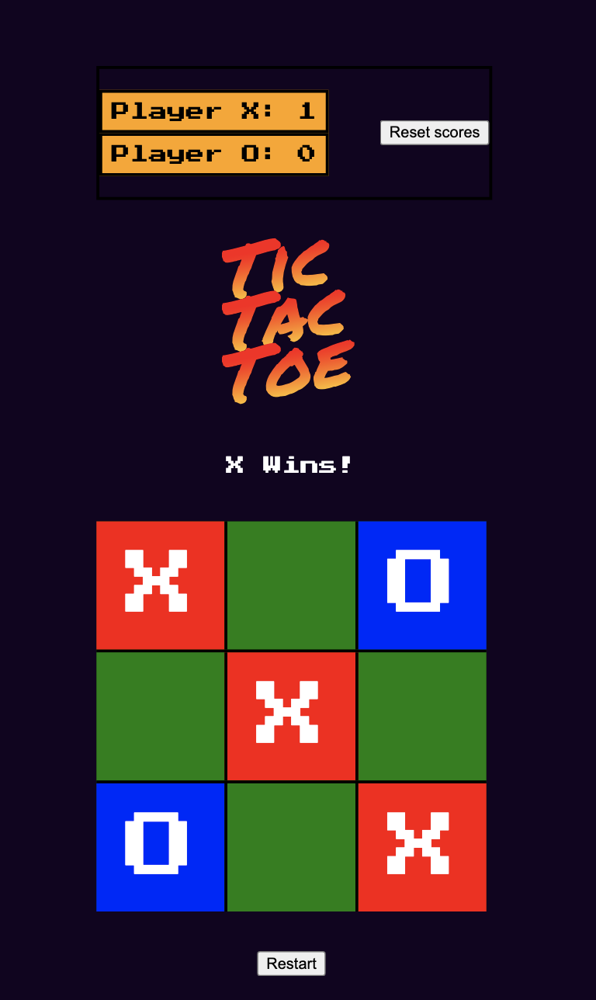

## TIC TAC TOE GAME

Hello there

this is my version of the classic tic tac toe game! Please go ahead and have fun!

## Design

The Game is composed of four classes:

- Board : handles rendering of the board and the game state
- Commentator : simply gives us feed back on whats happening
- ScoreBoard : tracks players scores over time
- PubSub : allows us to communicate altogether

## Features

- TypeScript typed for safety and clarity

- Accessible via keyboard navigation (tabindex, aria-labels, Enter support)

- Event-driven architecture using a lightweight PubSub system

- CSS Modules for scoped styling

- Responsive: playable across devices

- Testable: architecture structured for easy Jest testing

- Easy to extend: designed with future modularity in mind

## Future steps

### logic

I have begun isolating the Board UI logic into its own module, but the Board and Game remain tightly coupled by design. Full separation would mostly involve reorganizing code without meaningfully increasing flexibility, as the Board is still tailored to serve the Game's specific needs. Right now, the cost of decoupling would outweigh the benefits. However, if we introduce different types of games or boards in the future, a clearer boundary between them will provide real value beyond syntactic sugar.

### style

I will continue working on styling and adding fun celebration animations!

## Future Improvements

- Split Board and Game logic for greater flexibility (currently tightly coupled by design)

- Add AI opponent (Minimax algorithm)

- Multiplayer support (local and/or online)

- Improved animations and transitions

- Deploy a live version

## How to run

### Clone the repository

`git clone https://github.com/HuxleyIsMe/TicTacToe.git`

### Navigate into the project

`cd TicTacToe`

### Open the index.html file directly in your browser
